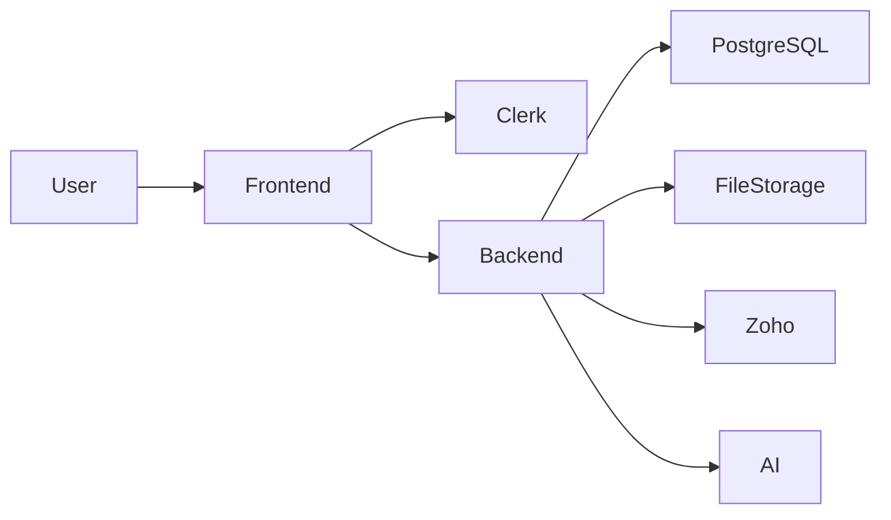

# JobLens — Recruitment CRM + ATS

Unified staffing CRM and applicant tracking for Consult America / JobLens operators.

## Product scope

Primary navigation:

1. Dashboard  
2. Zoho Inbox  
3. Jobs  
4. Candidates  
5. Pipeline  
6. Contacts  
7. Reports  
8. Settings  

The standalone job-seeker experience (Resume Analyzer, Discover Jobs, Job Matcher, browser extension pairing, etc.) remains in the repository behind `SEEKER_PRODUCT_ENABLED` / `NEXT_PUBLIC_SEEKER_PRODUCT_ENABLED` and is **not** the production CRM surface.

## Architecture

- **Frontend:** Next.js (App Router), TypeScript, Tailwind — `frontend/`  
- **Backend:** FastAPI, SQLAlchemy, Alembic — `backend/`  
- **Auth:** Clerk (ATS session JWT verified on the API)  
- **Database:** PostgreSQL in production (SQLite for local/dev only)  
- **AI:** Groq / OpenAI-compatible parsing (server-side keys only)  
- **Integrations:** Zoho Mail (optional)



## Local setup

### Backend

```bash
cd backend
python -m venv .venv
# Windows: .venv\Scripts\activate
source .venv/bin/activate
pip install -r requirements.txt
cp .env.example .env
uvicorn main:app --reload --port 8000
```

### Frontend

```bash
cd frontend
npm install
cp .env.example .env.local
npm run dev
```

CRM UI: http://localhost:3000/ats  

See [docs/ENVIRONMENT_VARIABLES.md](./docs/ENVIRONMENT_VARIABLES.md).

## Database migrations

```bash
cd backend
python -m alembic upgrade head
python -m alembic current
```

## Tests & build

```bash
cd backend && python -m pytest -q
cd frontend && npx tsc --noEmit && npm run build
```

Production smoke (no writes):

```bash
cd backend
SMOKE_BASE_URL=https://your-api.example.com python scripts/production_smoke_test.py
```

## Roles

`admin` · `manager` · `recruiter` · `read_only`  

Details: [docs/ROLE_PERMISSION_MATRIX.md](./docs/ROLE_PERMISSION_MATRIX.md)

## Deployment

- [docs/PRODUCTION_DEPLOYMENT.md](./docs/PRODUCTION_DEPLOYMENT.md)  
- [docs/PRODUCTION_QA_CHECKLIST.md](./docs/PRODUCTION_QA_CHECKLIST.md)  
- [docs/DATABASE_BACKUP_AND_RESTORE.md](./docs/DATABASE_BACKUP_AND_RESTORE.md)  
- [docs/ROLLBACK_PLAN.md](./docs/ROLLBACK_PLAN.md)  
- [docs/SECURITY_REVIEW.md](./docs/SECURITY_REVIEW.md)  
- [docs/ROUTE_CONSOLIDATION.md](./docs/ROUTE_CONSOLIDATION.md)  
- [docs/RELEASE_NOTES_v1.0.0.md](./docs/RELEASE_NOTES_v1.0.0.md)  

Legacy deploy notes also in [PRODUCTION.md](./PRODUCTION.md).

## License / private use

Internal recruitment operations tooling — do not commit secrets, résumé dumps, or database backups.
