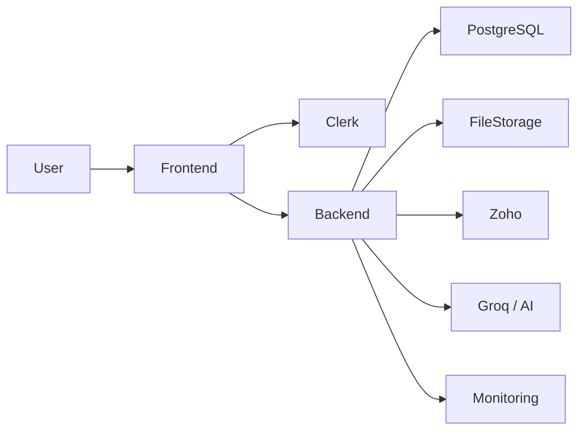

# Production Deployment

Unified Recruitment CRM + ATS deployment runbook.

## Architecture



## Components

| Layer | Typical host | Notes |
|-------|--------------|-------|
| Frontend | Vercel | Root `frontend/` |
| Backend | Render | Root `backend/`, uvicorn |
| Database | Managed PostgreSQL | `DATABASE_URL` |
| Auth | Clerk | Same project FE + BE |
| Files | Supabase / S3-compatible | Not local disk in prod |
| Zoho | Zoho Mail API | Optional |
| AI | Groq (OpenAI-compatible) | Server-side key only |
| Monitoring | Host logs + optional Sentry | |

## Commands

### Backend

```bash
cd backend
python -m alembic upgrade head   # once per release, controlled step
uvicorn main:app --host 0.0.0.0 --port $PORT --workers 2
```

Do **not** run destructive migrations from every worker on boot beyond a deliberate single migration step.

### Frontend

```bash
cd frontend
npm ci
npm run build
npm run start
```

## Health checks

- Liveness: `GET /health`
- Readiness: `GET /health/ready` (DB + production config checks; no secrets)

## Deployment sequence

1. Freeze features
2. Confirm release commit / tag
3. Database backup + restore drill
4. Confirm env vars ([ENVIRONMENT_VARIABLES.md](./ENVIRONMENT_VARIABLES.md))
5. Deploy backend RC
6. Run migrations **once**
7. Verify `/health/ready`
8. Run `scripts/production_smoke_test.py`
9. Deploy frontend RC
10. Authenticated smoke + role checks
11. Zoho / resume parse / pipeline / reports checks
12. Monitor errors → promote
13. Record release

## Rollback

See [ROLLBACK_PLAN.md](./ROLLBACK_PLAN.md).

## Owners

| Role | Responsibility |
|------|----------------|
| Release owner | Gate decision, tag, announce |
| Backend owner | Migrations, API health |
| Frontend owner | Vercel deploy, Clerk URLs |
| Data owner | Backups / restore |

Do not put secrets in this document.
